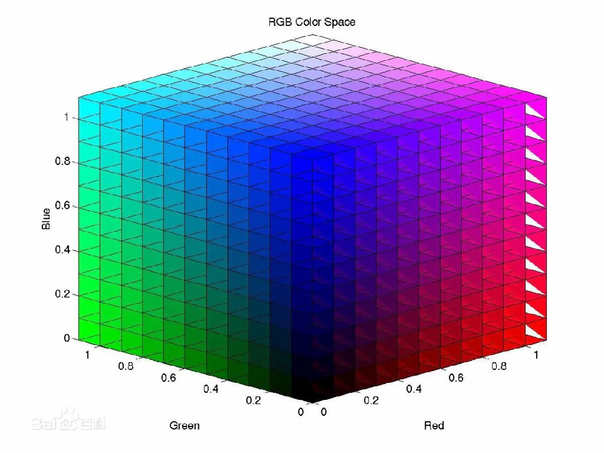

颜色空间概述
============

颜色的基本概念
--------------

亮度, 色度和饱和度
~~~~~~~~~~~~~~~~~~

**亮度**\ , 是光作用于人眼所引起的明亮程度的感觉, 它与被观察物体的发光强度有关. 
主要表现光的强和弱.

**色调**\ , 是当人眼看到一种或多种波长的光时所产生的色彩感觉, 它反映颜色的种类, 决定颜色的基本特征.

**饱和度**\ , 是指颜色的纯度, 即掺入白光的程度, 表示颜色深浅的程度.

.. note::

    色调, 表示是什么颜色. 
    饱和度, 表示颜色的深浅.

 
三基色(RGB)的原理
~~~~~~~~~~~~~~~~~

自然界常见的各种颜色光, 都是由红(R), 绿(G), 蓝(B)三种颜色光按不同比例混合而成的, 同样绝大多数颜色也可以分解成红, 绿, 蓝三种色光, 这就是色度学中最基本的原理 --- **三基色原理**\ .

颜色空间概述
------------

颜色通常用三个独立的属性来描述, 三个独立变量综合作用, 自然就构成一个空间坐标, 这就是颜色空间. 
但被描述的颜色对象本身是客观的, 不同颜色空间只是从不同的角度去衡量同一个对象. 
颜色空间按照基本机构可以分为两大类: **基色颜色空间**\ 和\ **色, 亮分离颜色空间**\ , 前者典型的是RGB, 后者包括YUV和HSV等.

.. note::

    颜色空间(colorspace), 就是颜色的表示方法.

RGB颜色空间
~~~~~~~~~~~

计算机彩色显示器和彩色电视机显示色彩的原理一样, 都是采用R, G, B相加混色的原理, 通过发射出三种不同强度的电子束, 使屏幕内侧覆盖的红绿蓝磷光材料发光而产生色彩. 
这种颜色的表示方法称为RGB颜色空间表示.

在RGB颜色空间中, 任意色光F都可以用R, G, B三色不同分量的相加混合而成: ``F = r[R] + r[G] + r[B]``\ . 
RGB颜色颜色空间还可以用一个三维的立方体来描述, 当三基色分量都为0(最弱)时混合光为黑色光; 当三基色都为k(最大值, 由存储空间决定)时混合光为白色光.

RGB颜色空间根据每个分量在计算机中占用的存储位数分为如下几种类型:

*   RGB555

RGB555是一种16位的RGB格式, 各分量都用5位表示, 剩下的一位不用.

.. code-block:: 

    XRRRRRGGGGGBBBBB

*   RGB565

RGB565也是一种16位的RGB格式, 但是R占用5位, G占用6位, B占用5位.

*   RGB24

RGB24是一种24位的RGB格式, 各分量占用8位, 取值范围为0~255.

*   RGB32

RGB32是一种32位的RGB格式, 各分量占用8位, 剩下的8位作为Alpha通道或者不用.

RGB颜色空间最大的优点就是适合于显示系统, 直观且容易理解, 但是对色彩描述上的应用还有以下不足:

    * RGB颜色空间利用三个颜色分量的线性组合来表示颜色, 不同的色彩难以用精确的数值来表示, 定量分析困难;
    * 在RGB颜色系统中, 三个颜色分量是高度相关的, 只要亮度改变, 三个分量都会相应的改变, 如果一个颜色的某一个分量发生了一定程度的改变, 那么这颜色很可能也要发生改变;
    * RGB颜色空间是一种均匀性较差的颜色空间, 因为人眼对于三种颜色分量的敏感程度是不一样的.

HSV颜色空间
~~~~~~~~~~~

HIS(Hue-Intensity-Saturation)颜色空间是图像处理中另一个常用的颜色空间, 它从人的视觉系统出发, 用色调(Hue), 饱和度(Saturation或Chroma)和亮度(Intensity或Brightness)来描述颜色. 

YUV颜色空间
~~~~~~~~~~~

在现代彩色电视系统中, 通常采用三管彩色摄像机或彩色CCD摄像机进行取像, 然后把取得的彩色图像信号经分色, 分别放大校正后得到RGB, 再经过矩阵变换电路得到亮度信号Y和两个色差信号R-Y(即U), B-Y(即V), 
最后发送端将亮度信号和两个色差总共三个信号分别进行编码, 用同一信道发送出去. 
这种颜色的表示方法就是所谓的YUV颜色空间表示. 
采用YUV颜色空间的重要性是它的亮度信号Y和色度信号U, V是分离的. 
如果只有Y信号分量而没有U, V信号分量, 那么这样表示的图像就是黑白灰度图像. 
彩色电视采用YUV空间正是为了用亮度信号Y解决彩色电视机与黑白电视机的兼容问题, 使黑白电视机也能接收彩色电视信号. 

YUV是一种亮度和色度相分离的颜色表示方法.
其中, Y表示明亮度(Luminance或Luma), 也就是灰阶值; 而U和V表示的则是色度(Chrominance或Chroma), 作用是描述色彩以及饱和度, 用于指定像素的颜色. 
亮度是通过RGB输入信号来建立的, 方法是将RGB信号的特定部分叠加到一起. 
色度则定义了颜色的两个方面: 色调和饱和度, 分别用Cr和Cb来表示. 
其中, Cr反映了RGB输入信号红色部分与RGB信号亮度值之间的差异, 而Cb反映的是RGB输入信号蓝色部分与RGB信号亮度值之间的差异.

颜色空间之间的转换
------------------

不同的颜色空间只是同一物理量的不同表示法, 它们之间存在着相互转换的关系, 这种转换可以通过数学公式的运算而得.

