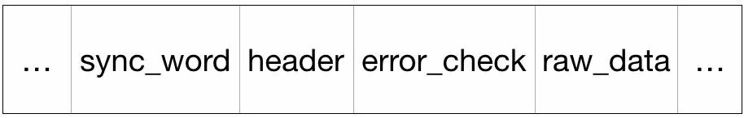

音视频基础知识概述
==================

视频
----

由于人类眼睛的特殊结构, 画面快速切换时, 画面会有残留, 感觉起来就是连贯的动作. 
所以, **视频就是由一系列图片构成的.**

视频帧
~~~~~~

**帧(frame)**\ , 是视频的一个基本概念, 表示一张画面. 
一个视频就是由许许多多帧组成的.

帧率
~~~~

**帧率**\ , 即单位时间内帧的数量, 单位为: 帧/秒或者fps(frame per second). 
帧率越高, 即单位时间内包含的图片越多, 画面越顺滑, 过度越自然.

帧率的几个典型值:

    *   24/25 fps: 1秒24/25帧, 一般的电影帧率.
    *   30/60 fps: 1秒30/60帧, 游戏的帧率, 30帧可以接收, 60帧会感觉更加流畅逼真.
    *   85 fps以上人眼基本无法察觉出来了, 所以更高的帧率在视频里没有太大意义.

颜色空间
~~~~~~~~

两种常见的颜色空间.

*   **RGB**

RGB颜色空间应该是我们最熟悉的一种, 在现在的电子设备中应用广泛. 
**通过R, G, B三种基础色, 可以混合出所有的颜色.**

*   **YUV**

**这是一种亮度与色度分离的颜色格式.**

早期的电视都是黑白的, 即只有亮度值, 即Y. 
有了彩色电视之后, 加入了UV两种色度, 形成了现在的YUV, 又叫YCbCr.

Y: 亮度, 就是灰度值. 除了表示亮度信号外, 还含有较多的绿色通道量.

U: 蓝色通道与亮度的差值.

V: 红色通道与亮度的差值.

.. note::

    采用YUV有什么优势呢?

    人眼对亮度敏感, 对色度不敏感, 因此减少部分UV的数据量, 人眼也无法感知出来, 
    这样可以通过压缩UV的分辨率, 在不影响观感的前提下, 较少数据量.

音频
----

音频数据的承载方式最常用的是\ **脉冲编码调制**\ , 即\ **PCM**\ .

在自然界中, 声音是连续不断的, 是一种模拟信号, 那怎样才能把声音保存下来呢? 
那就是把声音数字化, 即转换为数字信号. 

声音是一种波, 有自己的振幅和频率, 那么要保存声音, 就要保存声音在各个时间点上的振幅. 
而数字信号并不能连续保存所有时间点的振幅, 事实上, 并不需要保存连续的信号, 就可以还原到人耳可接受的声音.

根据奈奎斯特采样定理: 为了不失真地恢复模拟信号, 采样频率应该不小于模拟信号频谱中最高频率的2倍.

根据以上分心, PCM的采集步骤分为以下几步:

.. code-block::

    模拟信号 -> 采样 -> 量化 -> 编码 -> 数字信号

采样率和采样位数
~~~~~~~~~~~~~~~~

采样率, 即采样的频率. 

上面提到, 采样率要大于原声波频率的2倍, 人耳能听到的最高频率为20kHz, 所以为了满足人耳的听觉要求, 采样率至少为40kHz, 通常为44.1kHz, 更高的通常为48kHz.

采样位数, 涉及到上面的振幅量化. 
波形振幅在模拟信号上也是连续的样本值, 而在数字信号中, 信号一般是不连续的, 所以模拟信号量化以后, 只能取一个近似值, 为了记录这些振幅值, 采样器会采用一个固定的位数来记录这些振幅值, 通常有8位, 16位, 32位.

.. table::

    ===== ============ ===========
    位数  最小值       最大值
    8     0            255
    16    -32768       32767
    32    -2147483648  2147483647
    ===== ============ ===========

**位数越多, 记录的值越准确, 还原度越高.**

最后就是编码了. 
由于数字信号都是由0和1组成的, 因此, 需要将幅度值转换为一系列0和1进行存储, 也就是编码, 最后得到的数据就是数字信号: 一串0和1组成的数据.

声道数
~~~~~~

声道数, 是指支持能\ **不同发声**\ (注意是不同声音)的音响的个数.

*   单声道: 1个声道
*   双声道: 2个声道
*   立体声道: 默认2个声道
*   立体声道(4声道): 4个声道

码率
~~~~

码率, 是指一个数据流中每秒钟的数据量, 单位bps(bit per second).

.. code-block::

    码率 = 采样率 * 采样位数 * 声道数

为什么要压缩编码
----------------

这里的编码和上面音频中提到的编码不是同一个概念, 而是指\ **压缩编码**\ .

我们知道, 在计算机的世界中, 一切都是0和1组成的, 音频和视频数据也不例外. 
由于音视频的数据量庞大, 如果按照裸流数据存储的话, 那将需要耗费非常大的存储空间, 也不利于传输. 
而音视频中, 包含了大量0和1的重复数据, 因此可以通过一定的算法来压缩这些0和1的数据.

特别在视频中, 由于画面是渐变的, 因此整个视频中, 包含了大量画面/像素的重复, 这正好提供了非常大的压缩空间.

因此, 编码可以大大减小音视频数据的大小, 让音视频更容易存储和传输.

视频压缩编码
-------------

视频编码格式
~~~~~~~~~~~~~

视频编码格式有很多中, 比如H26x系列和MPEG系列的编码, 这些编码格式都是为了适应时代发展而出现的.

其中, H26x(1/2/3/4/5)系列由ITU(International Telecomunication Union)国际电传视讯联盟主导, 
MPEG(1/2/3/4)系列由MPEG(Moving Picture Experts Group, ISO旗下的组织)主导.

当然, 也有联合制定的编码标准, 那就是现在主流的编码格式H264, 还有下一代更先进的压缩编码标准H265.

H264编码简介
~~~~~~~~~~~~

**H264是目前最主流的视频编码标准**\ , 由ITU和MPEG共同制定.

.. note::

    H264编码算法十分复杂, 在日常开发中只需要了解相关概念. 
    实际上, 视频的编码和解码部分通常由框架(如FFmpeg)完成, 一般的开发者并不会接触到.

*   **视频帧**

视频是由一帧一帧画面构成的, 但是在视频的数据中, 并不是按照一帧一帧原始数据保存下来的.

H264会根据一段时间内, 画面的变化情况, 选取一帧画面作为完整编码, 下一帧只记录与上一帧完整数据的差别, 是一个动态压缩的过程.

在H264中, 有三种类型的帧数据:

    *   **I帧**\ : 帧内编码帧, 就是一个完整帧.
    *   **P帧**\ : 前向预测编码帧, 是一个非完整帧, 通过参考前面的I帧或P帧生成.
    *   **B帧**\ : 双向预测内插编码帧, 参考前后图像帧编码生成, B帧依赖其前最近的一个I帧或P帧以及其后最近的一个P帧.

*   **图像组(GOP)和关键帧(IDR)**

GOP(Group Of Picture), 指一组视频帧.

GOP的第一帧为关键帧: IDR.

IDR都是I帧, 可以防止一帧解码出错, 导致后面所有帧解码出错的问题. 
当解码器在解码遇到IDR的时候, 会将之前的参考帧清空, 重新开始一个新的序列, 这样, 即便前面一帧解码出现重大错误, 也不会蔓延到后面的数据中.

.. note::

    关键帧都是I帧, 但是I帧不一定是关键帧.

*   **DTS与PTS**

DTS(Decoding Time Stamp), 标示读入内存中的数据流在什么时候开始送入解码器中进行解码, 也就是解码顺序的时间戳.

PTS(Presentation Time Stamp), 用于标示解码后的视频帧什么时候显示出来.

.. note::

    在没有B帧的情况下, DTS和PTS的输出顺序是一样的, 一旦存在B帧, PTS和DTS则会不同.

*   **帧的颜色空间**

H264采用的颜色空间是YUV.

音频压缩编码
------------

音频压缩编码格式
~~~~~~~~~~~~~~~~

原始的PCM音频数据也是非常大的数据量, 因此也需要对其进行压缩编码. 

和视频编码一样, 音频也有许多的编码格式, 如: WAV, MP3, WMA, AAC, APE, FLAC等, 其中APE和FLAC属于无损压缩格式.

AAC编码简介
~~~~~~~~~~~

AAC是新一代的音频有损压缩技术, 一种高压缩比的音频压缩算法.

AAC格式主要有两种: **ADIF**\ 和\ **ADTS**\ .

ADIF(Audio Data Interchange Format), 音频数据交换格式, 
这种格式的特征是只有一个统一的头, 因此它的解码必须在开始处进行.
这种格式常用在磁盘文件中.

.. table:: ADIF数据格式

    ====== ========
    header raw_data
    ====== ========

ADTS(Audio Data Transport Stream), 音频数据传输流. 
这种格式的特征是可以在任意帧解码, 每一帧都有头信息.

ADTS一帧的数据格式:

音视频容器
----------

就是音视频的封装格式, 如FLV, MP4, RMVB, MKV, AVI...

所谓封装格式, 就是按照一定的格式将音频数据和视频数据混合在一起.

软解码和硬解码
--------------

所谓软解码, 就是利用CPU的计算能力来解码, 通常如果CPU的能力不是很强的时候, 解码速度会比较慢. 
但是, 由于使用统一的算法, 兼容性会很好.

硬解码, 指的是利用专门的芯片来加速解码. 
通常硬解码的速度会快很多, 但是由于硬解码由各个厂家实现, 质量参差不齐, 非常容易出现兼容性问题.

