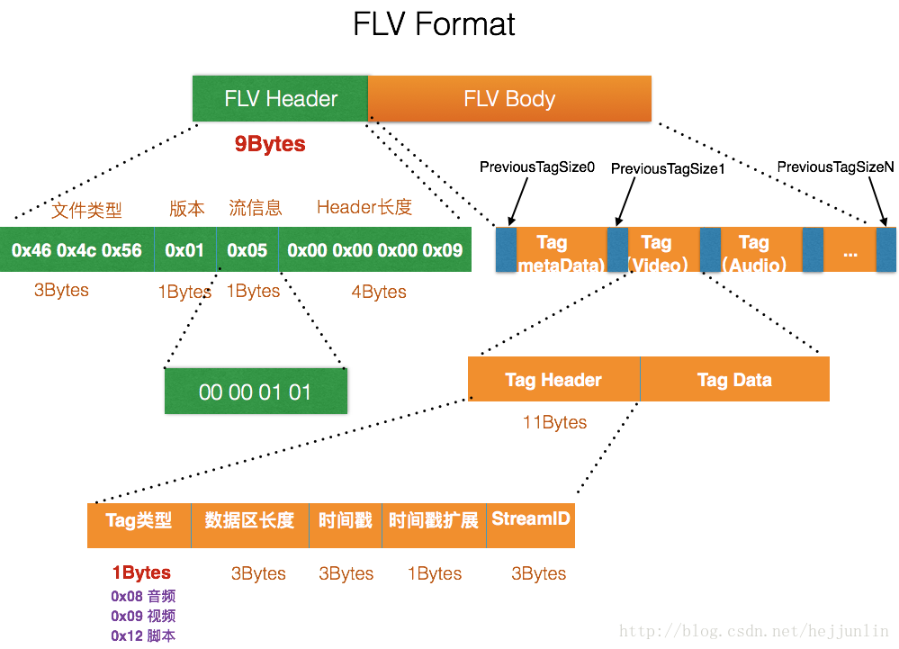
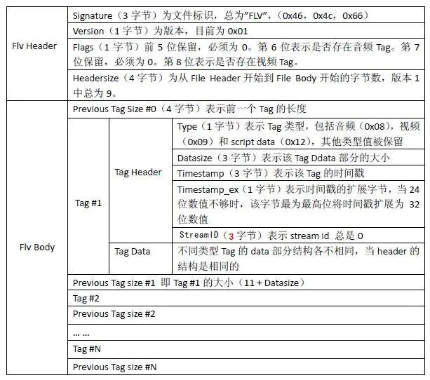
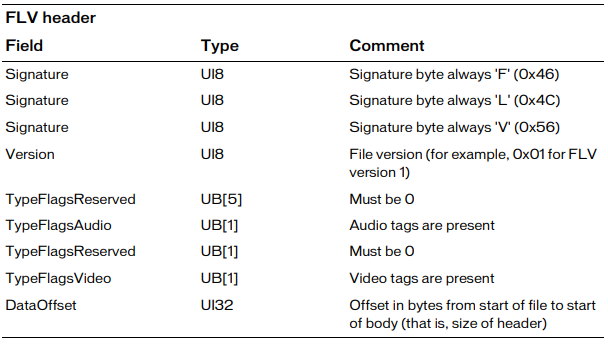
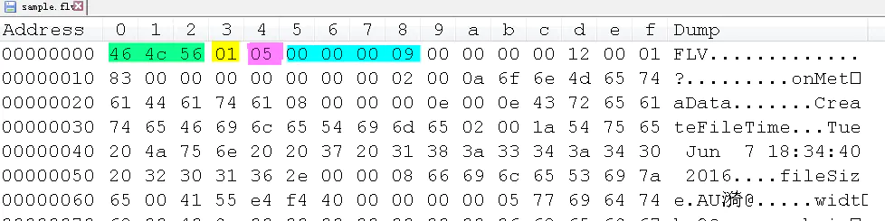
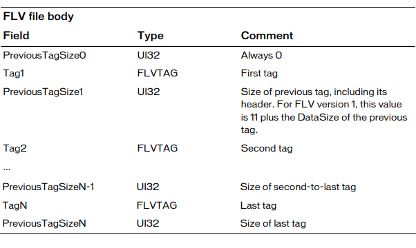
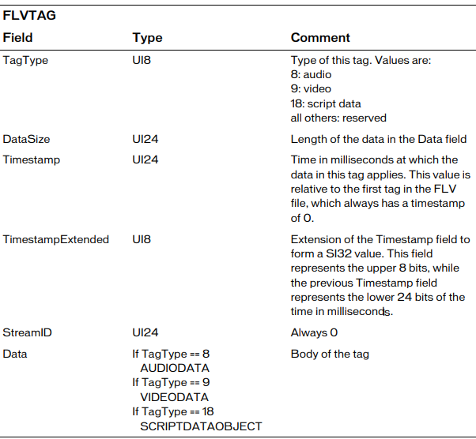
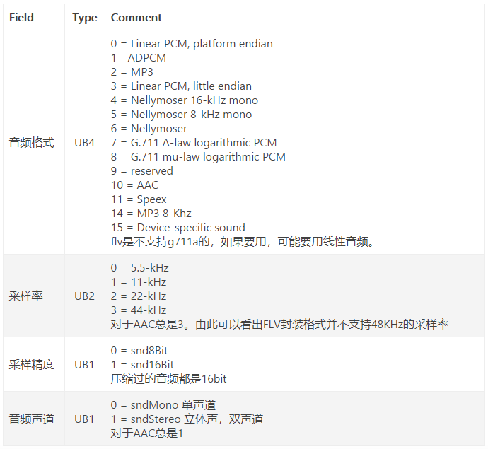
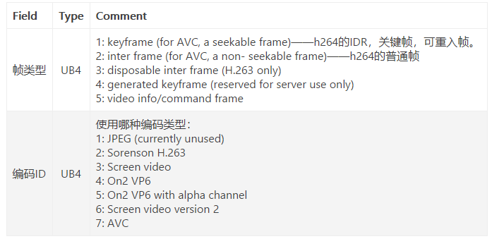

.. _flv-reference-label:

FLV封装格式
===========

FLV(Flash Video)是Adobe公司推出的一种流媒体格式, 由于其封装后的音视频文件体积小, 封装简单等特点, 非常适合于互联网上使用.
采用FLV格式封装的文件后缀为\ ``.flv``\ .

FLV封装格式由\ **文件头**\ (``FLV Header``)和\ **文件体**\ (``FLV Body``)组成.
其中, ``FLV Body``\ 由一对对的(``PreviousTagSize + Tag``)组成.
``PreviousTagSize``\ 字段排列在\ ``Tag``\ 之前，占用4个字节, 表示前面一个\ ``Tag``\ 的大小, 第一个\ ``PreviousTagSize``\ 的值为固定0.

.. attention::

    FLV数据以大端序进行存储, 在解析时需要注意.

一个标准的FLV文件结构如下图所示:

FLV文件的详细结构描述如下图所示:

FLV Header
----------

``FLV Header``\ 一般为9个字节, 主要有四个部分组成: **文件类型**\ , **版本信息**\ , **流信息**\ , **头长度**\ . 

*   **文件类型(3个字节)**
    
固定为16进制的\ ``0x46 0x4c 0x56``\ , 即字符\ ``F`` ``L`` ``V``\ 的ASCII值.

*   **版本信息(1个字节)**

当前版本为\ ``0x01``\ .

*   **流信息(1个字节)**

(从左往右)倒数第一位是1表示有视频, 倒数第三位是1表示有音频, 倒数第二, 四位必须是0.

例如, ``00 00 01 01``\ 表明文件中包含视频和音频, ``00 00 00 01``\ 表明文件种仅包含视频. 

*   **头长度(4个字节)**

表示\ ``FLV Header``\ 的长度, 在当前版本固定为9.

FLV Body
--------

``FLV Header``\ 之后就是\ ``FLV Body``\ .
``FLV Body``\ 由一连串的\ ``PreviousTagSize + Tag``\ 组成, ``PreviousTagSize``\ 表示前一个\ ``Tag``\ 的字节数据长度, 占4个字节. 
``FLV Body``\ 的第一个\ ``PreviousTagSize``\ 固定为0.

FLV Tag
~~~~~~~

每一个\ ``Tag``\ 也是由两部分组成: ``Tag Header`` + ``Tag Data``\ .

FLV Tag Header
^^^^^^^^^^^^^^

``Tag Header``\ 一般占11个字节, 存放的是: **当前Tag的类型**\ , **数据区(Tag Data)的长度**\ , **时间戳**\ 和\ **StreamID**\ .

*   **Tag Type(1个字节)**

表示\ ``Tag``\ 的类型, 可以是: **音频(8)**\ , **视频(9)**\ 或\ **Script(18)**\ .

*   **Data Size(3个字节)**

表示\ ``Tag Data``\ 的大小(单位是字节).

*   **TimeStamp(3个字节)**

当前帧的相对时间戳, 单位是毫秒. 

注意这里的时间戳是相对时间戳, 第一个tag的时间戳总是为0. 

*   **ExtendedTimeStamp(1个字节)**

如果时间戳大于\ ``0xFFFFFF``\ , 将会使用这个字节. 
这个字节是时间戳的高8位, 上面的\ ``TimeStamp``\ 是时间戳的低24位. 

*  **StreamID(3个字节)**

固定为0.

FLV Tag Data
^^^^^^^^^^^^

FLV Tag的类型可以是音频, 视频或Script. 

* **Script Tag Data**

该类型的Tag又被称为MetaData Tag, 存放一些关于FLV音频和视频的元信息, 比如: duration(文件的总时长), width, height等. 
通常该类型Tag会作为FLV文件的第一个tag, 并且只有一个, 跟在\ ``FLV Header``\ 之后. 

*   **Audio Tag Data**

音频Tag Data区域开始的第一个字节包含了音频数据的参数信息, 从第二个字节开始为音频流数据.

*   **Video Tag Data**

视频Tag Data开始的第一个字节包含视频数据的参数信息, 从第二个字节开始为视频流数据.

