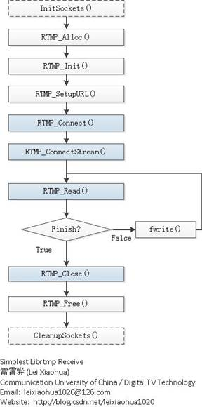
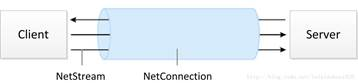

librtmp拉流示例(保存为FLV文件)
==============================

详细的基于librtmp的拉流过程, 可以参考\ ``RTMPDump``\ 的源码, 这里只是一个简单的示例, 只保留了拉流最核心的函数.

流程图
------

使用librtmp接收RTMP流的函数执行流程图如下图所示:

流程图中关键函数的作用如下图所示:

    *   ``InitSockets()``\ : 初始化Socket
    *   ``RTMP_Alloc()``\ : 为结构体\ ``RTMP``\ 分配内存
    *   ``RTMP_Init()``\ : 初始化结构体\ ``RTMP``\ 中的成员变量
    *   ``RTMP_SetupURL()``\ : 设置输入的RTMP连接的URL, 这里就是拉流的地址
    *   ``RTMP_Connect()``\ : 建立RTMP连接, 创建一个RTMP协议规范中的NetConnection
    *   ``RTMP_ConnectStream()``\ : 创建RTMP协议规范中的NetStream
    *   ``RTMP_Read()``\ : 读取数据
    *   ``RTMP_Close()``\ : 关闭RTMP连接
    *   ``RTMP_Free()``\ : 释放结构体\ ``RTMP``
    *   ``CleanupSockets()``\ : 关闭Socket

其中, NetConnection和NetStream是RTMP协议规范中的两个逻辑结构. 
NetStream建立在NetConnection之上, 一个NetConnection可以包含多个NetStream, 它们之间的关系如下图所示:

源码
----

.. code-block:: cpp

    /**
     * Simplest Librtmp Receive
     *
     * 雷霄骅，张晖
     * leixiaohua1020@126.com
     * zhanghuicuc@gmail.com
     * 中国传媒大学/数字电视技术
     * Communication University of China / Digital TV Technology
     * http://blog.csdn.net/leixiaohua1020
     *
     * 本程序用于接收RTMP流媒体并在本地保存成FLV格式的文件。
     * This program can receive rtmp live stream and save it as local flv file.
     */

    #include <stdio.h>
    #include "librtmp/rtmp_sys.h"
    #include "librtmp/log.h"

    int InitSockets()
    {
    #ifdef WIN32
	    WORD version;
	    WSADATA wsaData;
	    version = MAKEWORD(1, 1);
	    return (WSAStartup(version, &wsaData) == 0);
    #endif
    }

    void CleanupSockets()
    {
    #ifdef WIN32
	    WSACleanup();
    #endif
    }

    int main(int argc, char* argv[])
    {
	    InitSockets();
	
	    double duration = -1;
	    int nRead;
	    //is live stream ?
	    bool bLiveStream = true;				
	
	    int bufsize = 1024 * 1024 * 10;			
	    char *buf = (char*)malloc(bufsize);
	    memset(buf, 0, bufsize);
	    long countbufsize = 0;
	
	    FILE *fp = fopen("receive.flv","wb");
	    if (!fp){
		    RTMP_LogPrintf("Open File Error.\n");
		    CleanupSockets();
		    return -1;
	    }
	
	    /* set log level */
	    //RTMP_LogLevel loglvl=RTMP_LOGDEBUG;
	    //RTMP_LogSetLevel(loglvl);

	    RTMP *rtmp = RTMP_Alloc();
	    RTMP_Init(rtmp);
	    //set connection timeout, default 30s
	    rtmp->Link.timeout = 10;	
	    // HKS's live URL
	    if (!RTMP_SetupURL(rtmp,"rtmp://live.hkstv.hk.lxdns.com/live/hks"))
	    {
		    RTMP_Log(RTMP_LOGERROR, "SetupURL Err\n");
		    RTMP_Free(rtmp);
		    CleanupSockets();
		    return -1;
	    }
	    if (bLiveStream)
		    rtmp->Link.lFlags |= RTMP_LF_LIVE;
	
	    //1hour
	    RTMP_SetBufferMS(rtmp, 3600 * 1000);		
	
	    if (!RTMP_Connect(rtmp, NULL)){
		    RTMP_Log(RTMP_LOGERROR, "Connect Err\n");
		    RTMP_Free(rtmp);
		    CleanupSockets();
		    return -1;
	    }

	    if (!RTMP_ConnectStream(rtmp, 0)){
		    RTMP_Log(RTMP_LOGERROR, "ConnectStream Err\n");
		    RTMP_Close(rtmp);
		    RTMP_Free(rtmp);
		    CleanupSockets();
		    return -1;
	    }

	    while (nRead = RTMP_Read(rtmp, buf, bufsize)){
		    fwrite(buf, 1, nRead, fp);

		    countbufsize += nRead;
		    RTMP_LogPrintf("Receive: %5dByte, Total: %5.2fkB\n", nRead, countbufsize*1.0/1024);
	    }

	    if (fp)
		    fclose(fp);

	    if (buf)
		    free(buf);

	    if (rtmp){
		    RTMP_Close(rtmp);
		    RTMP_Free(rtmp);
		    CleanupSockets();
		    rtmp = NULL;
	    }	
	    return 0;
    }
    
******

**原文地址**\ : `最简单的基于librtmp的示例: 接收(RTMP保存为FLV) <https://blog.csdn.net/leixiaohua1020/article/details/42104893>`_

Github: https://github.com/leixiaohua1020/simplest_librtmp_example

开源中国: http://git.oschina.net/leixiaohua1020/simplest_librtmp_example

本工程中包含了librtmp的使用示例, 包含如下子工程:

    *   simplest_librtmp_receive: 接收RTMP流媒体并在本地保存成FLV格式的文件.
    *   simplest_librtmp_send_flv: 将FLV格式的音视频文件使用RTMP推送至RTMP流媒体服务器.
    *   simplest_librtmp_send264: 将内存中的H264数据推送至RTMP流媒体服务器.

