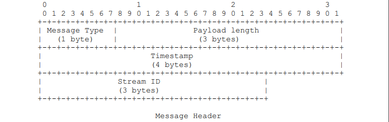
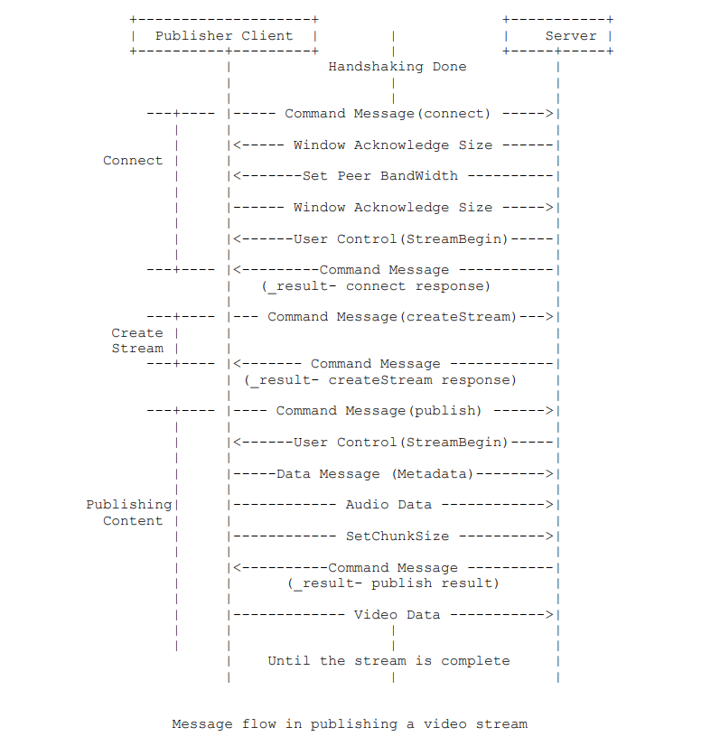
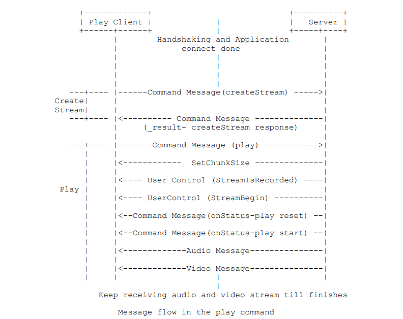

RTMP协议
========

**RTMP(Real Time Message Protocol, 实时信息传输协议)**\ , 它是由Adobe公司提出的一种\ **应用层的协议**\ , 
**用来解决多媒体数据传输流的多路复用(Multiplexing)和分包(Packetizing)的问题**\ .

.. note::

    所谓多路复用, 是指在一个网络连接上传输多种类型的数据.

    所谓分包, 是指将大的数据分块发送.

简介
----

RTMP协议是应用层协议, 需要依靠底层的传输层协议(通常是TCP)来保证信息传输的可靠性.

在基于传输层协议的链接建立完成之后, RTMP协议还需要客户端和服务器通过"握手"来建立基于传输层链接之上的\ **RTMP Connection**\ (可以理解为应用层的链接), 
在RTMP Connection上会传输一些控制信息, 如\ ``SetChunkSize``\ , ``SetACKWindowSize``\ 等, 其中\ ``CreateStream``\ 命令会创建Stream链接, 用于传输具体的音视频数据和控制这些信息传输的命令信息.

.. note::

    对于RTMP, 在传输层的链接建立完成之后, 还需要通过应用层的握手建立RTMP应用层的链接(RTMP Connection). 

RTMP协议传输时会对数据做自己的格式化, 这种格式的消息我们称之为\ **RTMP Message**\ .
而实际传输的时候为了更好地实现多路复用, 分包和信息的公平性, 发送端会把Message划分为带有Message ID的Chunk, 
每个Chunk可能是一个单独的Message, 也可能是Message的一部分, 在接收端会根据Chunk中包含的data长度, Message ID和Message的长度把Chunk还原成完整的Message, 从而实现信息的收发.

.. note::

    在RTMP中, 消息的单位是Message, 但是在收发时以Chunk为单位.

**除了握手阶段之外, 其它的信息都是以RTMP Message的格式发送的.**

.. note::

    **握手**\ 和\ **消息块**\ 概念 

    握手的目的是为了确认对端RTMP的Version和确认对端能互相通信.

    消息块就是消息的载体, 是RTMP协议最重要的载体, 这个载体是有一定格式的, 如果把Client和Server端当作铁路的两个站点, 那这个消息块就是火车, 它负责运输货物. 
    正如火车有火车头、车厢一样, 消息块也有基本头, 消息头和消息负载.
    RTMP协议当中, 除了握手协议, 其他的数据都是以消息块的方式发送的, 发送一个消息时, 当块大小比需要发送的消息的字节数更大时, 一个消息块就相当于一个消息, 否则消息需要分成多个消息块.

握手
----

要建立一个有效的RTMP Connection链接, 首先要"握手": 客户端要向服务器发送\ ``C0``, ``C1``, ``C2``\ (按序)三个Chunk, 服务器向客户端发送\ ``S0``, ``S1``, ``S2``\ (按序)三个Chunk, 然后才能进行有效的信息传输. 
RTMP协议本身并没有规定这6个Message的具体传输顺序, 但RTMP协议的实现者需要保证以下几点:

    -  客户端要等收到S1之后才能发送C2;
    -  客户端要等收到S2之后才能发送其它信息(控制信息和真实音视频等数据);
    -  服务端要等收到C0之后才发送S1;
    -  服务端必须等到收到C1之后才能发送S2;
    -  服务端必须等到收到C2之后才能发送其它信息(控制信息和真实音视频等数据).

理论上来讲, 只要满足以上条件, 如何安排6个Message的顺序都是可以的, 但实际中为了在保证握手的身份验证功能的基础上尽量减少通信的次数, 一般的发送顺序是这样的(可以通过wireshark抓ffmpeg推流包进行验证):

    - Client发送C0C1给Server;
    - Server发送S0S1S2给Client;
    - Client发送C2给Server.

.. code-block::

    +-+-+-+-+-+-+            +-+-+-+-+-+-+
    |  Client   |            |  Server   |
    +-+-+-+-+-+-+            +-+-+-+-+-+-+
        |--------- C0C1 -------->|     
        |<------- S0S1S2  -------|
        |---------- C2 --------->|

RTMP Chunk Stream
-----------------

Chunk Stream是对RTMP Chunk的流的逻辑上的抽象, 客户端和服务器之间有关RTMP的信息都在这个流上通信.

Message
^^^^^^^

这里的Message是指满足RTMP协议格式的, 可以切分为Chunk发送的消息, 消息包含的字段如下:

*   ``TimeStamp``: 消息的时间戳, 4个字节.
*   ``Length``: 指Message Playlod(消息负载)即音视频等信息的数据长度, 3个字节.
*   ``TypeId``: 消息的类型, 1个字节.
*   ``Message Stream ID``: 当前Message的一个标识, 表示Message属于哪一个Stream. 4个字节, 并且以小端格式存储.

.. note:: 
    
    在创建RTMP链接之后, 会在RTMP链接的基础上创建Stream通道, 用Stream通道用来传输数据(Stream通道可以理解为传输数据的逻辑通道). 
    Stream通道可以有多个, 用Stream ID(CSID)来标识.

    在Stream通道上可以传输多种不同类型的数据流, 在Stream通道上传输的数据流就是用Message Stream ID来标识是哪一个数据流.
    Different message streams multiplexed onto the same chunk stream are demultiplexed based on their message stream IDs.

.. note::

    RTMP Message包含的字段, 和FLV Tag Header的字段"正好"对得上, 所以通常可以认为一个FLV Tag对应一个RTMP Message.
    
    :ref:`flv-reference-label`

Chunk
^^^^^

RTMP在收发数据的时候并不是以Message为单位的, 而是把Message拆分成Chunk发送的, 而且必须在一个Chunk发送完成之后才能开始发送下一个Chunk. 
每个Chunk中带有Message ID代表属于哪个Message, 接收端按照这个ID来将Chunk组装成Message.

为什么RTMP要将Message拆分成不同的Chunk呢? 
通过拆分, 数据量较大的Message可以被拆分成较小的"Message", 这样就可以避免低优先级低的消息持续发送阻塞高优先级的数据. 
比如在视频的传输过程中, 会包括视频帧, 音频帧和RTMP控制信息, 如果持续发送音频数据或者控制数据的话可能就会造成视频帧的阻塞, 然后就会造成看视频时最烦人的卡顿现象. 
同时对于数据量较小的Message, 可以通过对Chunk Header的字段来压缩信息, 从而减少信息的传输量.

Chunk的默认大小是128字节, 在传输过程中, 通过\ ``Set Chunk Size``\ 控制信息可以设置Chunk数据量的最大值, 在发送端和接收端会各自维护一个Chunk Size, 可以分别设置这个值来改变自己这一方发送的Chunk的最大大小. 
大一点的Chunk减少了计算每个Chunk的时间从而减少了CPU的占用率, 但是它会占用更过的时间在发送上, 尤其是在低带宽的情况下, 很可能会阻塞后面更重要信息的传输. 
小一点的Chunk可以减少这种阻塞问题, 但小的Chunk会引入过多额外的信息(Chunk Header), 少量多次的传输也可能会造成发送的间断导致不能充分利用高带宽的优势, 因此不适合在高比特率的流中传输. 
在实际发送时应对发送的数据用不同的Chunk Size去尝试, 通过抓包分析等手段得出合适的Chunk Size, 并且在传输过程中可以根据当前的带宽信息和实际信息的大小动态调整Chunk的大小, 从而尽量提高CPU的利用率并减少信息的阻塞几率.

.. note::

    ``Set Chunk Size``\ 是设置Chunk的最大值, 并非是固定Chunk的大小.

每个Chunk都由\ ``Chunk Header``\ 和 ``Chunk Data``\ 组成.

.. code-block:: 

    +-------+     +--------------+----------------+  
    | Chunk |  =  | Chunk Header |   Chunk Data   |  
    +-------+     +--------------+----------------+

Chunk Header
~~~~~~~~~~~~

``Chunk Header``\ 由\ ``Basic Header`` + ``Message Header`` + ``ExtendedTimeStamp``\ (不一定存在)组成.

.. code-block:: 

    +--------------+     +-------------+----------------+-------------------+ 
    | Chunk Header |  =  | Basic header| Message Header |ExtendedTimestamp  |  
    +--------------+     +-------------+----------------+-------------------+

Chunk Basic Header
++++++++++++++++++

``Chunk Basic Header``\ 包含了\ ``chunk type``\ 和\ ``chunk stream ID``\ (流通道ID). 
``chunk type``\ 决定了后面的\ ``Messge Header``\ 的格式. 
``chunk stream ID``\ 一般简写为\ ``CSID``\ , 用来标识一个特定的流通道.

``Chunk Basic Header``\ 的长度可能是1, 2或3个字节, 取决于\ ``CSID``\ 的大小, 其中\ ``chunk type``\ 的长度是固定的(占第一个字节的前2个bit).

.. note::

    根据\ ``CSID``\ 的长度, 使用不同长度的字节.
    
    在足够存储的前提下用尽量少的字节从而减少数据量.

RTMP协议支持用户自定义[3, 65599]之间的\ ``CSID``\ , 0, 1, 2由协议保留表示特殊信息. 

*   当\ ``Basic Header``\ 为1个字节时, ``CSID``\ 占6位, 6位最多可以表示64个数, 因此这种情况下\ ``CSID``\ 在[0, 63]之间, 其中用户可自定义的范围位[3, 63];

.. code-block::

     0 1 2 3 4 5 6 7
    +-+-+-+-+-+-+-+-+
    |fmt|  cs id    |
    +---+-+-+-+-+-+-+

*   当\ ``Basic Header``\ 为2个字节时, ``CSID``\ 占14位, 此时协议将与\ ``chunk type``\ 所在字节的其它位置都置为0, 剩下的一个字节用来表示\ ``CSID - 64``\ , 
    这样共有8个bit用来存储\ ``CSID``, 8bit可以表示[0, 255]共256个数, 因此这种情况下\ ``CSID``\ 在[64, 319]之间(64+0=64, 64+255=319);

.. code-block::

     0 1 2 3 4 5 6 7 8 9 0 1 2 3 4 5   
    +-+-+-+-+-+-+-+-+-+-+-+-+-+-+-+-+
    |fmt|     0     |  cs id - 64   |
    +-+-+-+-+-+-+-+-+-+-+-+-+-+-+-+-+

*   当\ ``Basic Header``\ 为3个字节时, ``CSID``\ 占22位, 此时协议将与\ ``chunk type``\ 所在字节的其它位置都置为1, 剩下的2个字节用来表示\ ``CSID - 64``\ , 
    这样共有16个bit来存储\ ``CSID``\ , 16位可以表示[0, 65535]共65536个数, 因此这种情况下\ ``CSID``\ 在[64, 65599].

.. code-block:: 

     0 1 2 3 4 5 6 7 8 9 0 1 2 3 4 5 6 7 8 9 0 1 2 3
    +-+-+-+-+-+-+-+-+-+-+-+-+-+-+-+-+-+-+-+-+-+-+-+-+
    |fmt|     1     |       cs id - 64              |
    +-+-+-+-+-+-+-+-+-+-+-+-+-+-+-+-+-+-+-+-+-+-+-+-+

.. code-block:: c
    :emphasize-lines: 4, 5, 6

    // 以下是上述 chuck stream id 类型非全部：
    typedef NS_ENUM(NSUInteger, RTMPChunckStreamID)
    {
        RTMPChunckStreamID_PRO_CONTROL       = 0x2, // 协议控制块流ID  
        RTMPChunckStreamID_COMMAND           = 0x3, // 控制块流ID  
        RTMPChunckStreamID_MEDIA             = 0x4, // 音视频块流ID  
    };

Chunk Message Header
++++++++++++++++++++

**包含了要发送的实际信息(可能是完整的, 也可能是一部分)的描述信息.**

``Message Header``\ 的格式和长度取决于\ ``Basic Header``\ 的\ ``chunk type``\ , 共有四种不同的格式.
其中第一种格式是完整的格式, 可以表示其它三种表示的所有数据, 
但由于其它三种格式是对基于之前chunk的差量化的表示, 因此可以更简洁地表示相同的数据, 实际使用的时候还是应该采用尽量少的字节表示相同意义的数据.

以下按照字节数从多到少的顺序分别介绍这四种格式的\ ``Chunk Message Header``:

*   **Type 0**

.. code-block:: 

                Chunk Message Header - Type 0                

      0                   1                   2                   3   
      0 1 2 3 4 5 6 7 8 9 0 1 2 3 4 5 6 7 8 9 0 1 2 3 4 5 6 7 8 9 0 1 
     +-+-+-+-+-+-+-+-+-+-+-+-+-+-+-+-+-+-+-+-+-+-+-+-+-+-+-+-+-+-+-+-+  
     |                     timestamp                 | message length|
     +-------------------------------+---------------+---------------+  
     |       message length(cont)    |message type id| msg stream id | 
     +-------------------------------+---------------+---------------+ 
     :            message stream id(cont)            |  
     +-+-+-+-+-+-+-+-+-+-+-+-+-+-+-+-+-+-+-+-+-+-+-+-+

Type = 0时, ``Message Header``\ 占用11个字节, 其它三种能表示的数据它都能表示, 但在chunk stream开始的第一个chunk和头信息的时间戳后退(即值与上一个chunk相比减小, 通常在回退播放时会出这种情况)的时候必须采用这种格式.

    -   ``timestamp``\ (时间戳): 占用3个字节, 最大表示\ :math:`16777215 = 0xFFFFFF = 2^{24}-1`\ , 超出这个值, 这3个字节置为1, 将实际的时间戳转存到\ ``Extended Timestamp``\ 字段中, 接收端在判断timestamp字段24个位都为1时就会去\ ``Extended Timestamp``\ 字段中解析实际的时间戳.

    -   ``message length``\ (消息数据的长度): 占用3个字节, 表示实际发送的消息的数据如音频帧, 视频帧等数据的长度, 单位是字节. 
        **注意这里是Message的长度, 也就是chunk属于的Message的总数据长度, 而不是chunk本身Data的数据的长度.**

    -   ``message type id``\ (消息的类型id): 占用1个字节, 表示实际发送的数据的类型, 如8代表音频数据, 9代表视频数据.

    -   ``message stream id``\ (消息的流id): 占用4个字节, 表示该chunk所在的流的ID, 和\ ``Basic Header``\ 的\ ``CSID``\ 一样, 它采用小端存储的方式.

*   **Type 1**

.. code-block::

                Chunk Message Header - Type 1                

     0                   1                   2                   3   
     0 1 2 3 4 5 6 7 8 9 0 1 2 3 4 5 6 7 8 9 0 1 2 3 4 5 6 7 8 9 0 1 
    +-+-+-+-+-+-+-+-+-+-+-+-+-+-+-+-+-+-+-+-+-+-+-+-+-+-+-+-+-+-+-+-+  
    |                     timestamp delta           | message length|
    +-------------------------------+---------------+---------------+  
    |       message length(cont)    |message type id|
    +-------------------------------+---------------+

Type = 1时, ``Message Header``\ 占用7个字节, 省去了表示\ ``message stream id``\ 的4个字节, 表示此chunk和上一个chunk所在的流相同, 如果发送端只和对端有一个流连接的时候可以尽量去采用这种格式.

    -   ``timestamp delta``\ : 占用3个字节, 注意这里和type = 0时不同, 存储的是和上一个chunk的时间差. 
        类似上面提到的timestamp, 当它的值超过3个字节所能表示的最大值时, 三个字节都置为1, 时间的时间戳差值就会转存到\ ``Extended Timestamp``\ 字段中.

*   **Type 2**

.. code-block::

    
                Chunk Message Header - Type 2                

     0                   1                   2     
     0 1 2 3 4 5 6 7 8 9 0 1 2 3 4 5 6 7 8 9 0 1 2 3
    +-+-+-+-+-+-+-+-+-+-+-+-+-+-+-+-+-+-+-+-+-+-+-+-+
    |                     timestamp delta           |
    +-------------------------------+---------------+

Type = 2时, ``Message Header``\ 占用3个字节, 相对于Type = 1格式又省去了表示消息长度的3个字节和表示消息类型的1个字节, 表示此chunk和上一次发送的chunk所在的流, 消息的长度和消息的类型都相同. 
余下的三个字节表示\ ``timestamp delta``\ , 使用同Type = 1相同.

*   **Type 3**

0字节!!! 表示这个chunk的\ ``Message Header``\ 和上一个完全相同. 
当它跟在Type = 0的chunk后面时, 表示和前一个chunk的时间戳都是相同的. 
什么时候连时间戳都是相同的呢? 就是一个Message拆分成了多个chunk, 这个chunk和上一个chunk同属于一个Message. 
而当它跟在Type = 1或者Type = 2的chunk后面时, 表示和前一个chunk的时间戳差是相同的. 
比如第一个chunk的Type = 0, timestamp = 100, 第二个chunk的Type = 2, timestamp delta = 20, 表示时间戳为100+20 = 120, 第三个chunk的Type = 3, timestamp delta = 20, 时间戳为120 + 20 = 140.

之前我们就说过, ``Basic Header``\ 中的\ ``chunk type``\ 字段, 决定了\ ``Message Header``\ 的格式, 它们的对应关系如下:

.. table::

    ============ =====================
    chunk type   Message Header的格式
    0            Type 0
    1            Type 1
    2            Type 2
    3            Type 3
    ============ =====================

.. code-block:: c

   // 以下是上述Basic Header中fmt值枚举
   typedef NS_ENUM(NSUInteger, RTMPBHFmt)
   {
       RTMPBHFmt_FULL              = 0x0,
       RTMPBHFmt_NO_MSG_STREAM_ID  = 0x1,
       RTMPBHFmt_TIMESTAMP         = 0x2, // 'Chuck Message Header' only timestamp
       RTMPBHFmt_ONLY              = 0x3, // 'Chunk Message Header' all no
   };
   
   // 以下是上述 message type id 类型非全部
   typedef NS_ENUM(NSUInteger, RTMPMessageTypeID)
   {
       RTMPMessageTypeID_CHUNK_SIZE     = 0x1, //协议控制消息 ChunkData承载大小，进行分块
       RTMPMessageTypeID_ABORT          = 0x2, //协议控制消息 消息分块只收到部分时，发送此控制消息，发端不在
       RTMPMessageTypeID_BYTES_READ     = 0x3, //协议控制消息
       RTMPMessageTypeID_PING           = 0x4, //用户控制消息 该消息在Chunk流中发送时，msg stream id = 0, chunck stream id = 2, message type id = 4
       RTMPMessageTypeID_SERVER_WINDOW  = 0x5, //协议控制消息
       RTMPMessageTypeID_PEER_BW        = 0x6, //协议控制消息
       RTMPMessageTypeID_AUDIO          = 0x8, //音频消息
       RTMPMessageTypeID_VIDEO          = 0x9, //视频消息
       RTMPMessageTypeID_FLEX_STREAM    = 0xF,
       RTMPMessageTypeID_FLEX_OBJECT    = 0x10,
       RTMPMessageTypeID_FLEX_MESSAGE   = 0x11,
       RTMPMessageTypeID_NOTIFY         = 0x12, //数据消息，传递一些元数据
       RTMPMessageTypeID_SHARED_OBJ     = 0x13, //
       RTMPMessageTypeID_INVOKE         = 0x14, //命令消息，客户端与服务器之间执行命令如：connect、publish
       RTMPMessageTypeID_METADATA       = 0x16, //
   };

ExtendedTimestamp
+++++++++++++++++

.. code-block:: 

     0                   1                   2                   3   
     0 1 2 3 4 5 6 7 8 9 0 1 2 3 4 5 6 7 8 9 0 1 2 3 4 5 6 7 8 9 0 1 
    +-+-+-+-+-+-+-+-+-+-+-+-+-+-+-+-+-+-+-+-+-+-+-+-+-+-+-+-+-+-+-+-+ 
    |                           timestamp                           |   
    +-+-+-+-+-+-+-+-+-+-+-+-+-+-+-+-+-+-+-+-+-+-+-+-+-+-+-+-+-+-+-+-+

只有当块消息头中的普通时间戳设置为\ ``0xffffff``\ 时, 本字段才被传送.
如果普通时间戳的值小于\ ``0xffffff``\ , 那么本字段一定不能出现.

Chunk Data
~~~~~~~~~~

``Chunk Data``\ 的实例就是Message.

The server and the client send RTMP messages over the network to communicate with each other. 
The messages could include audio, video, data, or any other messages.

The RTMP message has two parts, a header and its playload.

.. code-block::

    Message = Message Header + Message Playload

Message Header(11 bytes)
++++++++++++++++++++++++

.. code-block::

    Message Header = Message Type + Playload Length + TimeStamp + Stream ID

The message Header contains the following:

*   ``Message Type(1 byte)``

One byte field to represent the message type. 
A range of type IDs(1-6) are reserved for protocol control message.

*   ``Length(3 bytes)``

Three-byte field that represents the size of the playload in bytes. 
It is set in big-endian format.

*   ``TimeStamp(4 bytes)``

Four-byte field that contains a timestamp of the message. 
The 4 bytes are packed in the big-endian order.

*   ``Message Stream Id(3 bytes)``

Three-byte field that identifies the stream of the message. 
These bytes are set in big-endian format.

Message Playload
++++++++++++++++

The other part of the message is the payload, which is the actual data contained in the message. 
For example, it could be some audio samples or compressed video data.

Message的分类
-------------

*   **Protocol Control Messages**

协议控制消息, 用来与对端协调控制.

RTMP Chunk Stream uses message type IDs 1, 2, 3, 5, and 6 for protocol control messages. 

These protocol control messages MUST have message stream ID 0(known as the control stream)and be sent in chunk stream ID 2. 
Protocol control messages take effect as soon as they are received; their timestamps are ingnored.

    -   Set Chunk Size(Message Type ID = 1)

    设置块的大小，通知对端使用新的块大小.

    -   Abort Message(Message Type ID = 2)

    取消消息, 用于通知正在等待接收块以完成消息的对等端, 丢弃一个块流中已经接收的部分并且取消对该消息的处理.

    -   Acknowledgement(Message Type ID = 3)

    确认消息, 客户端或服务端在接收到数量与窗口大小相等的字节后发送确认消息到对方. 

    -   Window Acknowledgement Size(Message Type ID = 5)

    确认窗口大小, 客户端或服务端发送本消息来通知对方发送确认消息的窗口大小.

    -   Set Peer Bandwidth(Message Type ID = 6)
  
    设置对端带宽, 客户端或服务端发送本消息更新对等端的输出带宽.

*   **Command Messsage(Message Type ID = 17或20)**

命令消息, 表示在客户端和服务器之间传递的在对端执行某些操作的命令消息. 
如\ ``connect``\ 表示连接对端, 对端如果同意连接的话会记录发送端信息并返回连接成功消息; 
``publish``\ 表示开始向对方推流, 接收端接到命令后准备好接收对方发送的流信息.

当信息使用AMF0编码时, Messsage Type ID = 20, AMF3编码时Message Type ID = 17.

*   **Data Message(Message Type ID = 15或18)**

数据消息, 传递一些元数据(MetaData, 比如视频名, 分辨率等)或者用户自定义的一些消息. 

当消息使用AMF0编码时, Message Type ID = 18, AMF3编码时Message Type ID = 15.

*   **Shared Object Message(Message Type ID = 16或19)**

共享消息, 表示一个Flash类型的对象, 由键值对的集合组成, 用于多客户端, 多实例的使用. 

当信息使用AMF0编码时, Message Type ID = 19, AMF3编码时Message Type ID = 16.

*   **Audio Message(Message Type ID = 8)**

音频数据消息.

*   **Video Message(Message Type ID = 9)**

视频数据消息.

*   **Aggregate Message(Message Type ID = 22)**

聚类消息, 多个RTMP子消息的集合.

*   **User Control Message Events(Message Type ID = 4)**

用户控制消息, 客户端或服务端发送本消息通知对方用户的控制事件, 比如Stream Begin事件告知对方流信息开始传输. 和前面提到的协议控制信息(Protocol Control Message)不同, 这是在RTMP协议层的, 而不是在RTMP chunk流协议层的, 这个很容易弄混. 
该信息在chunk流中发送时, Message Stream ID = 0, Chunk Stream ID = 2, Message Type ID = 4.

Comand Message(命令消息, Message Type ID = 17或20)
^^^^^^^^^^^^^^^^^^^^^^^^^^^^^^^^^^^^^^^^^^^^^^^^^^

发送端发送时会带有命令的名字, 如\ ``connect``\ , ``TranscationID``\ 表示此次命令的标识, ``Command Object``\ 表示相关参数.

接收端收到命令后, 会返回以下三种消息中的一种: 
``_result``\ 消息表示接收该命令, 对端可以继续往下执行流程; ``_error``\ 消息代表拒绝该命令要执行的操作, ``method name``\ 消息代表要在之前命令的发送端执行的函数名称. 
这三种回应的消息都要带有收到的命令消息中的\ ``TranscationdID``\ 来表示本次的回应作用于哪个命令.

命令消息有两种: 一种是NetConnection Commands , 表示双端的上层连接, 一种是NetStream Commands , 表示流信息的传输通道, 控制流信息的状态.

*   **NetConnection Commands(连接层的命令)**

用来管理双端之间的连接状态, 同时也提供了异步远程方法调用(RPC)在对端执行某方法, 以下是常见的连接层命令:

    -  ``connect``

    用于客户端向服务器发送连接请求. 
    
    消息的回应有两种, ``_result``\ 表示接收连接, ``_error``\ 表示连接失败.

    -   ``call``

    用于在对端执行某函数, 即常说的RPC.

    -   ``close``

    Close connection.

    -   ``createStream``

    创建传递具体信息的通道, 从而可以在这个Stream通道中传递具体信息, 传输信息的单位为Chunk.

*   **NetStream Commands(流连接上的命令)**

    NetStream建立在NetConnection之上, 通过NetConnection的\ ``createStream``\ 命令创建, 用于传输具体的音频, 视频等信息.
    在传输层协议之上只能创建一个NetConnection, 但一个NetConnection可以建立多个NetStream来建立不同的流通道传输数据.

    以下是一些常用的NetStrea Commands, 服务端收到命令后会通过\ ``onStatus``\ 命令来响应客户端, 表示当前NetStream的状态.

    -   ``play``\ (播放): 由客户端向服务器发起请求从服务器端接收数据.
    -   ``play2``\ (播放): 和play命令不同的是, play2命令可以将当前正在播放的流切换到同样数据但不同比特率的流上.
    -   ``deleteStream``\ (删除流): 用户客户端告知服务端本地的某个流对象已被删除, 不需要传输此路流.
    -   ``closeStream``
    -   ``receiveAudio``\ (接收音频): 通知服务器端该客户端是否要发送音频.
    -   ``receiveVideo``\ (接收视频): 通知服务器端该客户端是否要发送视频.
    -   ``publish``\ (推送数据): 由客户端向服务器发起请求推流到服务器.
    -   ``seek``\ (定位流的位置): 定位到视频或音频的某个位置, 以毫秒为单位.
    -   ``pause``\ (暂停): 客户端告知服务端停止或恢复播放.

接收命令消息反馈结果(Respond Command)
~~~~~~~~~~~~~~~~~~~~~~~~~~~~~~~~~~~~~

通过块消息携带的数据, 拼接成消息内容, 通过AMF解码后解析消息内容.

代表流程
--------

*   推流

*   播流

